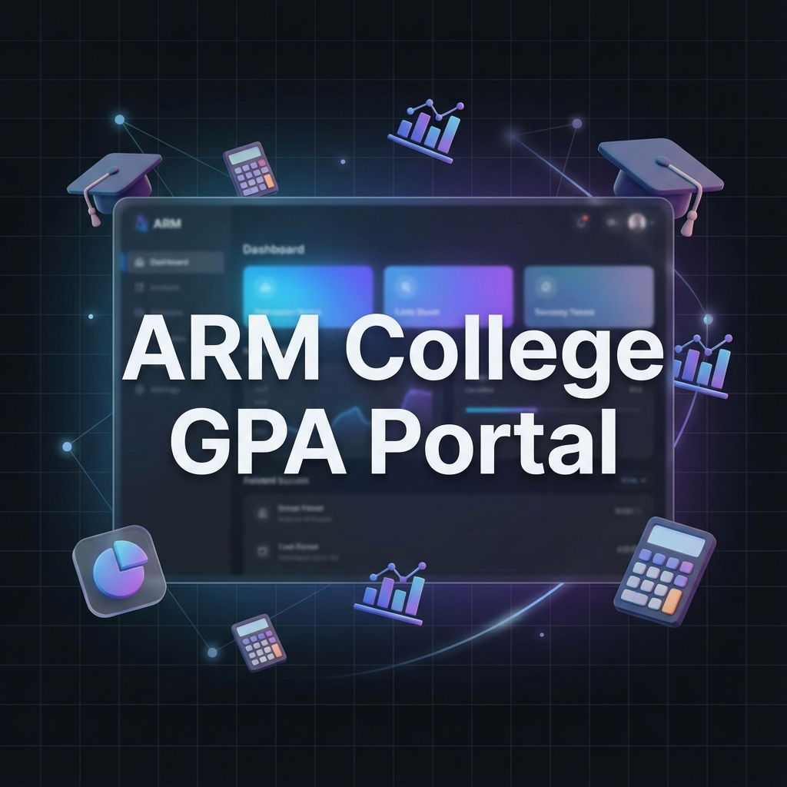

# 🎓 ARM College GPA Portal



> A premium, tech-forward SGPA & CGPA calculation platform with AI-driven academic assistance.

Designed for students of **ARM College of Engineering and Technology**, this portal offers a sleek, modern interface for calculating, saving, and analyzing academic performance.

---

## ✨ Features

- 🚀 **Smart SGPA Calculator**: Calculate semester GPA with real-time feedback and dynamic row management.
- 📊 **CGPA & Weighted Calculations**: Comprehensive CGPA calculation with support for cumulative weighting.
- 📄 **Professional PDF Export**: Generate and download high-quality PDF reports of your grades.
- 🕰️ **Calculation History**: Locally-hosted database to track your progress over time.
- 🎨 **Premium UI/UX**: Glassmorphism design, smooth transitions, and responsive layout for all devices.

## 🛠️ Technology Stack

- **Frontend**: HTML5, CSS3 (Vanilla), JavaScript (ES6+)
- **Backend**: Node.js, Express.js
- **Database**: JSON-based local storage (via `fs-extra`)
- **Libraries**:
  - `jsPDF` - For PDF generation
  - `Lucide Icons` - For modern iconography
  - `Google Fonts (Outfit)` - For premium typography

---

## 🚀 Quick Start

### 1. Prerequisites
- [Node.js](https://nodejs.org/) installed on your machine.
- A modern web browser.

### 2. Installation
```bash
# Clone the repository
git clone https://github.com/YOUR_USERNAME/sgpa-cgpa-portal.git

# Enter the directory
cd sgpa-cgpa-portal

# Install backend dependencies
cd server
npm install
```

### 3. Running the App
```bash
# Start the server (from the server directory)
npm start
```
The application will be available at **[http://localhost:3000](http://localhost:3000)**.

---

## 📖 Usage Guide

- **Calculator Tab**: Switch between SGPA, CGPA, and Percentage modes easily.
- **History Tab**: View your previous calculations. Make sure the server is running to use this feature!

## 📄 License

Distributed under the **MIT License**. See `LICENSE` for more information.

---

Built with ❤️ for ARM College Students.
